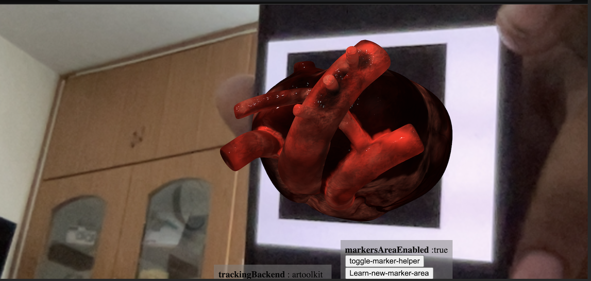
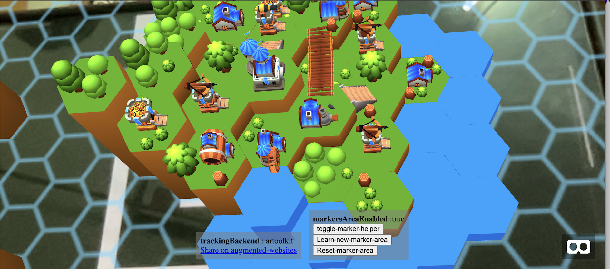
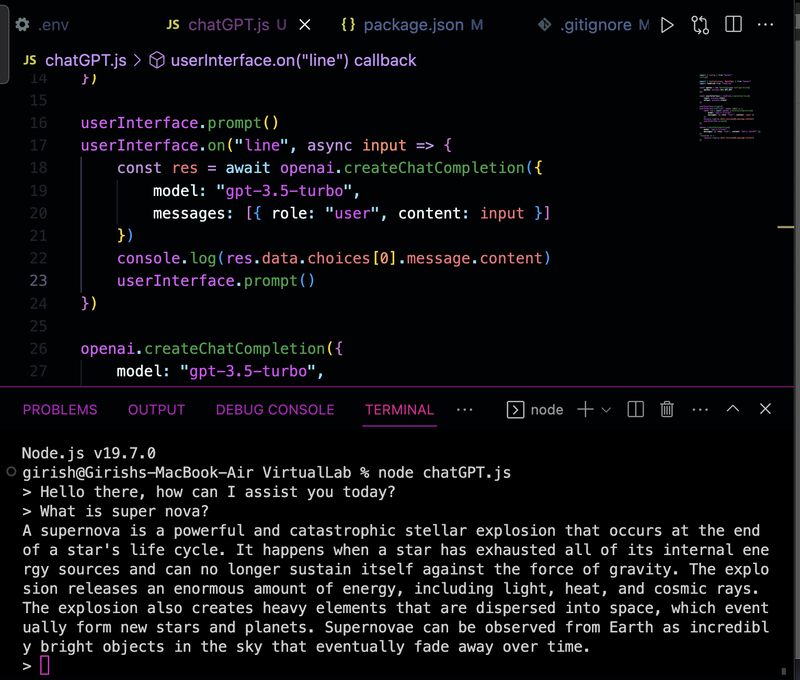
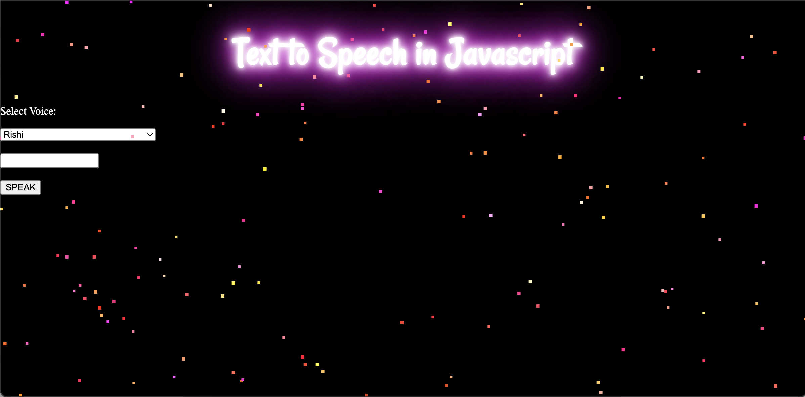
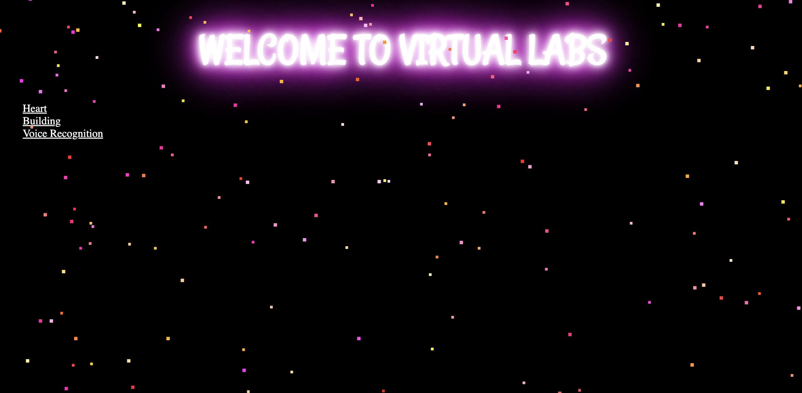

# VirtualLab
This repository is created for demonstrating my idea for Hack Solstice Hackathon.

Problem Statement:
Many schools does not have the lab facilities. Particularly, understanding concepts in science, like in the field of biology would not be feasible without visualizing. In order bring the taste of the lab accessible to all students across the globe, we could use the AR technology in order to demonstrate the concepts, which helps students to visualize and understand better.

Apart from this, this project aims to help specially challenged students. For instance, by adding voice to text feature for blind students, we could help them to learn. Through this project, I get the inputs, like queries through voice to text format, as currently this is not available with Chat GPT, and by using the Chat GPT API, I could fetch the result of the query and bring back the result to them

Apart from this, I also integrated some features like performing calculation for blind students by voice to text recognition.

Students can see the heart and all its dimensions, hence, it helps every students to visualise the heart structure and hence they could better understand the working of the heart

Also, with the AR technology, it is helpful for the architects to plan the structure of the building, hence the loss could be minimised as the work of prototyping is not necessary

This is getting input through the text area

For the blind people, they could give input through Voice to Text which is fed into the chatGPT model, as it is not currently available in OpenAI to recognise the speech and there queries could be answered, which could be read out

The answer from the ChatGPT can be read out load through this module

This is the basic design of the home page
